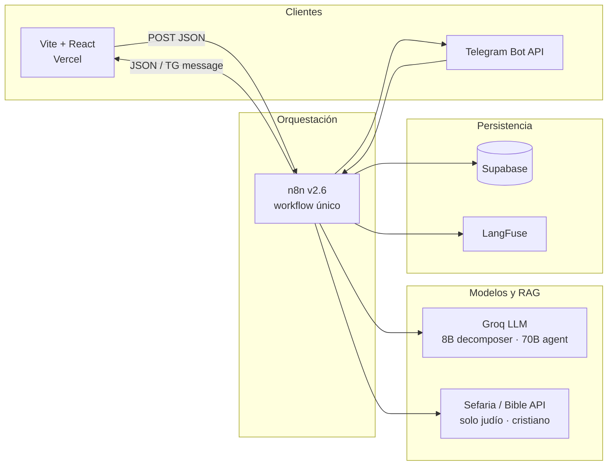

# god_is_typing v2.6 — System architecture

> **ES:** [Resumen en español](#español) · **EN:** [English summary](#english)  
> Operational n8n fixes (Parse Decomposition, web egress): [`N8N_FIX_WEB.md`](./N8N_FIX_WEB.md)

---

## Español

### Visión del sistema

**god_is_typing** es un orquestador conversacional multi-tradición con dos superficies de entrada (**Telegram** y **Web**) y un único grafo de negocio en **n8n**. El usuario elige un camino espiritual/filosófico, formula una pregunta breve y recibe una respuesta estilo carta (a veces con cita textual en ramas con RAG).

La web no replica reglas de negocio: actúa como **cliente delgado** que envía un contrato JSON al webhook y renderiza la respuesta.

### Diagrama de contexto



### Decisiones de arquitectura relevantes

| Decisión | Alternativa descartada | Por qué |
|----------|------------------------|---------|
| **Un workflow n8n, dos canales** | Microservicios o backends duplicados por canal | Un solo lugar para prompts, límites, logging y ramas por deidad; menor deriva entre TG y web. |
| **`Normalize Context` como contrato canónico** | Normalizar distinto por canal sin fusión | Tras este nodo, switches y agentes leen el mismo shape (`source`, `language`, `deity`, mensaje, ids). |
| **Rate limit antes de LLM/RAG** | Cuota solo en frontend | El límite de 3 preguntas / 24 h se aplica en servidor (Supabase + code nodes) **antes** de Groq; evita coste y abuso. |
| **`ip_hash` en web, no IP cruda** | Enviar IP real al navegador | Fingerprint SHA-256 en cliente (UA, locale, pantalla, tz, id anónimo); alinea privacidad con RGPD-lite y tabla `web_rate_limit`. |
| **RAG solo judío/cristiano** | RAG para todas las tradiciones | Budismo, Panteón y Yo futuro omiten decomposer + APIs; menor latencia y coste. |
| **`Final Source Switch` en egreso** | `Assemble → Send Response` directo | En web el `chatId` es hash, no chat TG; separar **Respond Success** vs **Send Response** evita `chat not found`. |
| **SPA estática + n8n serverless** | API Node intermedia | Vercel sirve solo assets; la lógica vive en n8n Cloud (operaciones sin desplegar servidor propio). |
| **Cuota UX en `localStorage` + servidor** | Solo cliente | UI muestra preguntas restantes al instante; la verdad autoritativa sigue en Supabase vía n8n. |

### Frontend (este repositorio)

| Pieza | Rol |
|-------|-----|
| `src/pages/Landing.tsx` | Entrada, CTA a `/ask` y enlace Telegram. |
| `src/pages/Ask.tsx` | Selección de deidad, textarea (280 chars), ritual de envío → `/reveal`. |
| `src/pages/Reveal.tsx` | Llama webhook, estado *typing*, carta con respuesta/cita. |
| `src/api.ts` | Cliente HTTP tipado; errores `network`, `http_404`, shape inválido. |
| `src/fingerprint.ts` | `ipHash` estable por navegador (16 hex). |
| `src/context/AppProvider.tsx` | Idioma, deidad, sesión, cuota local, webhook config. |
| `src/i18n.ts` | ES / EN sin librería externa. |

**Flujo web:** `sessionStorage` guarda pregunta pendiente → `Reveal` hace `POST` → borra pending al éxito → `recordQuestion()` en cliente.

### Backend (n8n + Supabase)

Pipeline resumido:

```text
Entrada → Normalize Context → Route Event / Source Switch
→ Rate Limit (chat_id | ip_hash)
→ Route Decomposition Need → [Decomposer | Bypass]
→ Route by Deity → Agent (+ RAG)
→ Assemble → Log Conversation → Restore Final Response
→ Final Source Switch → Web JSON | Telegram
```

**Integridad Supabase (obligatorio):**

- `user_state.chat_id` UNIQUE  
- `rate_limit.chat_id` UNIQUE  
- `web_rate_limit.ip_hash` UNIQUE  

Ver `supabase/web_rate_limit.sql` y `deploy/db/schema.sql`.

### Despliegue

| Capa | Destino |
|------|---------|
| Frontend | Vercel (`vercel.json` SPA rewrites) |
| Orquestación | n8n Cloud (webhook producción, workflow activo) |
| DB / logs | Supabase |
| Bot | Telegram (mismo workflow, trigger aparte) |

Variable crítica: `VITE_N8N_WEBHOOK_URL` → `https://…/webhook/godistyping-web` (no `webhook-test`).

---

## English

### System vision

**god_is_typing** is a multi-tradition conversational orchestrator with two entry surfaces (**Telegram** and **Web**) and a **single n8n business graph**. The user picks a spiritual/philosophical path, asks a short question, and receives a letter-like answer (sometimes with a textual citation on RAG-enabled branches).

The web app does not duplicate business rules: it is a **thin client** posting a JSON contract to the webhook and rendering the response.

### Context diagram

(Same as above — see Mermaid block in the Spanish section.)

### Relevant architecture decisions

| Decision | Rejected alternative | Rationale |
|----------|---------------------|-----------|
| **One n8n workflow, two channels** | Per-channel microservices | Single source for prompts, quotas, logging, deity branches; no TG/web drift. |
| **`Normalize Context` as canonical contract** | Divergent per-channel shapes | Downstream nodes share one state object (`source`, `language`, `deity`, message, ids). |
| **Rate limit before LLM/RAG** | Client-only quota | 3 questions / 24 h enforced server-side **before** Groq; blocks cost and abuse. |
| **`ip_hash` on web, not raw IP** | Browser-sent IP | SHA-256 fingerprint (UA, locale, screen, tz, anonymous id); privacy-friendly `web_rate_limit` key. |
| **RAG only on Jewish/Christian** | RAG for all traditions | Buddhist/Pantheon/Future Self skip decomposer + APIs; lower latency and cost. |
| **`Final Source Switch` at egress** | `Assemble → Send Response` directly | Web `chatId` is a hash, not a Telegram chat; **Respond Success** vs **Send Response** prevents `chat not found`. |
| **Static SPA + serverless n8n** | Custom Node API layer | Vercel serves assets only; orchestration stays in n8n Cloud. |
| **UX quota in `localStorage` + server** | Client-only enforcement | Instant “questions left” UI; Supabase remains authoritative via n8n. |

### Frontend (this repository)

| Piece | Role |
|-------|------|
| `src/pages/Landing.tsx` | Entry, CTA to `/ask`, Telegram link. |
| `src/pages/Ask.tsx` | Deity selection, textarea (280 chars), send ritual → `/reveal`. |
| `src/pages/Reveal.tsx` | Webhook call, typing state, letter with answer/citation. |
| `src/api.ts` | Typed HTTP client; errors `network`, `http_404`, invalid shape. |
| `src/fingerprint.ts` | Stable per-browser `ipHash` (16 hex). |
| `src/context/AppProvider.tsx` | Language, deity, session, local quota, webhook config. |
| `src/i18n.ts` | ES / EN without external i18n library. |

**Web flow:** `sessionStorage` holds pending question → `Reveal` `POST`s → clears pending on success → client `recordQuestion()`.

### Backend (n8n + Supabase)

Summarized pipeline:

```text
Input → Normalize Context → Route Event / Source Switch
→ Rate Limit (chat_id | ip_hash)
→ Route Decomposition Need → [Decomposer | Bypass]
→ Route by Deity → Agent (+ RAG)
→ Assemble → Log Conversation → Restore Final Response
→ Final Source Switch → Web JSON | Telegram
```

**Supabase integrity (required):**

- `user_state.chat_id` UNIQUE  
- `rate_limit.chat_id` UNIQUE  
- `web_rate_limit.ip_hash` UNIQUE  

See `supabase/web_rate_limit.sql` and `deploy/db/schema.sql`.

### Deployment

| Layer | Target |
|-------|--------|
| Frontend | Vercel (`vercel.json` SPA rewrites) |
| Orchestration | n8n Cloud (production webhook, active workflow) |
| DB / logs | Supabase |
| Bot | Telegram (same workflow, separate trigger) |

Critical env: `VITE_N8N_WEBHOOK_URL` → `https://…/webhook/godistyping-web` (not `webhook-test`).

---

## Repository map

```text
godistyping/
├── src/                 # React SPA (web channel)
├── n8n/                 # Workflow exports (import into n8n Cloud)
├── supabase/            # SQL migrations / rate limit
├── docs/                # Architecture, deploy, n8n fixes
├── deploy/              # Docker / full DB schema (broader monorepo)
├── integrations/n8n/    # Tradition prompts (extended corpus)
└── vercel.json          # SPA routing for React Router
```

## Further reading

- [`STACK.md`](./STACK.md) — technology stack  
- [`N8N_FIX_WEB.md`](./N8N_FIX_WEB.md) — web channel troubleshooting  
- [`README_v2_6.md`](./README_v2_6.md) — detailed v2.6 checklist & testing  
- [`DEPLOY.md`](./DEPLOY.md) — step-by-step deploy (ES)
