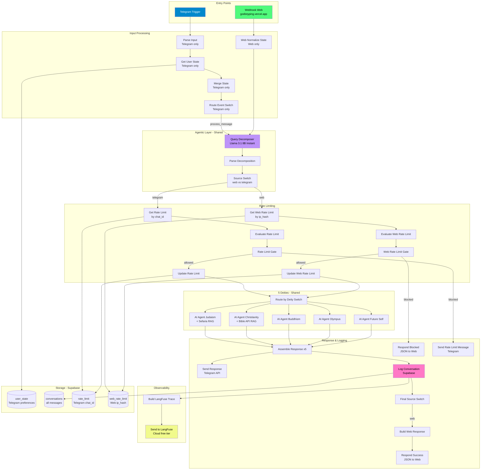
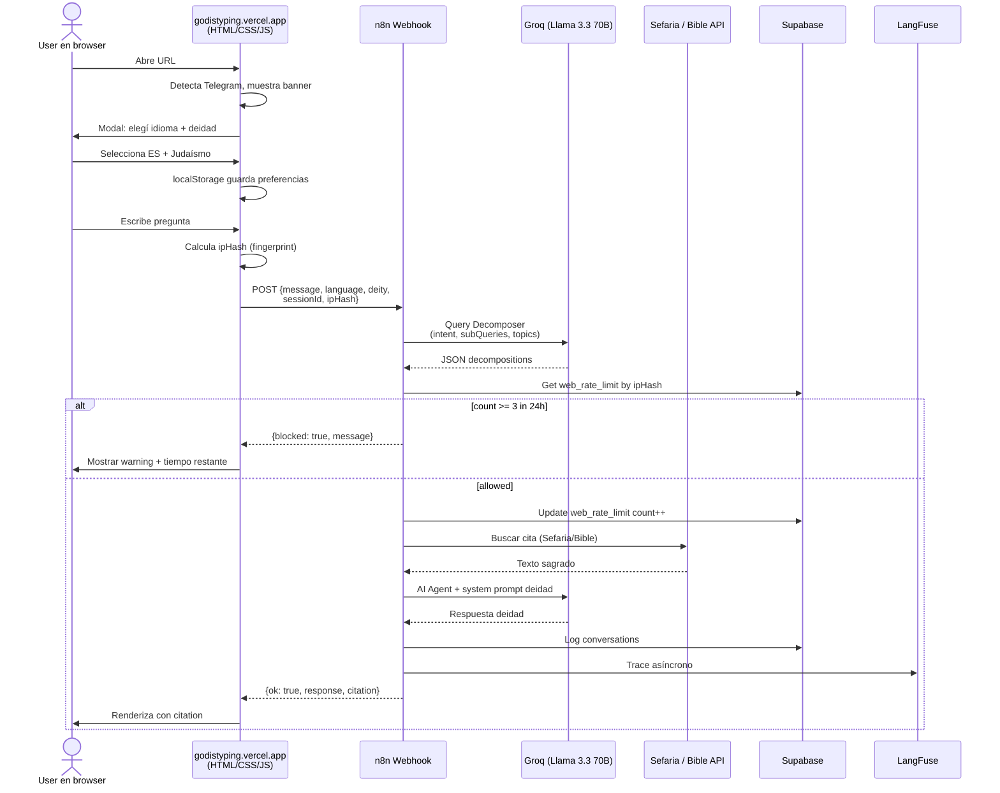

# god_is_typing v2.6 — Multi-channel architecture

## Qué es v2.6

La sexta iteración del proyecto, ahora con **dos canales de entrada**:

1. **Telegram** — `@god_is_typing_bot` (existente desde v2.5)
2. **Web** — `godistyping.vercel.app` (nuevo en v2.6)

Ambos canales comparten el **mismo backend** de n8n: el mismo Query Decomposer, los mismos AI Agents para las 5 deidades, el mismo logging y observability. Solo cambia el entry-point y el tracking de rate limit (chat_id para Telegram, hash de IP para web).

---

## Diagrama de arquitectura



---

## Flujo end-to-end de una pregunta web



---

## Pasos pre-deployment

### Paso 1: Crear tabla `web_rate_limit` en Supabase

1. Andá a Supabase → SQL Editor → New query
2. Pegá el contenido de `web_rate_limit.sql`
3. Run

### Paso 2: Importar workflow v2.6 en n8n

1. n8n → workflow v2.5-pro-rl actual → **Download** (backup)
2. **+ Add workflow** → Import from File → `god_is_typing_v2_6.json`

### Paso 3: Configuración manual de nodos nuevos

Hay **9 nodos nuevos** que probablemente necesiten configuración manual (mismo patrón que las veces anteriores):

#### A) Webhook Web
- HTTP Method: **POST**
- Path: `godistyping-web`
- Response Mode: **"Respond to Webhook" Node**
- Settings: dejar default

#### B) Get Web Rate Limit (Supabase)
- Operation: **Get All**
- Table: `web_rate_limit`
- Return All: ON
- Filters: `ip_hash` equals `={{ $json.ipHash }}`
- **Settings → Always Output Data: ON**
- **Settings → Continue On Fail: ON**

#### C) Update Web Rate Limit (Supabase Advanced)
- Operation: **Create or Update**
- Table: `web_rate_limit`
- Fields:
  | Field | Value |
  |-------|-------|
  | ip_hash | `={{ $json.ipHash }}` |
  | count | `={{ $json.rateLimit.count }}` |
  | window_start | `={{ $json.rateLimit.windowStart }}` |
  | last_message_at | `={{ new Date().toISOString() }}` |
- **On Conflict:** `ip_hash`

#### D) Respond Blocked & Respond Success (Respond to Webhook)
- Respond With: **JSON**
- Response Body: `={{ JSON.stringify($json) }}`
- Headers:
  - `Access-Control-Allow-Origin: *`
  - `Content-Type: application/json`

#### E) Source Switch
- Branch 0 (web): `={{ $json.source }}` equals `web`
- Branch 1 (telegram): `={{ $json.source }}` notEquals `web`

#### F) Final Source Switch
- Branch 0 (web): `={{ $json.source }}` equals `web`
- (Fallback output: none — los Telegram simplemente no entran a ninguna rama)

### Paso 4: Verificar CORS

El Webhook debe aceptar requests del dominio donde hostees el HTML.

Si Vercel: `https://godistyping.vercel.app`
Si subdominio custom: lo que sea

**Para testing inicial, usar `Access-Control-Allow-Origin: *`** (permisivo). Después restringirlo en producción.

### Paso 5: Obtener la URL del webhook

Una vez activado, n8n te da la URL pública del webhook. Va a ser algo como:

```
https://n8n-latest-ot5n.onrender.com/webhook/godistyping-web
```

**Anotala**, la necesitás para el frontend.

### Paso 6: Configurar el frontend

1. Abrí `godistyping.html`
2. Buscá la sección `CONFIG`:
   ```javascript
   const CONFIG = {
     WEBHOOK_URL: 'https://n8n-latest-ot5n.onrender.com/webhook/godistyping-web',
     ...
   };
   ```
3. Reemplazá la URL si difiere

### Paso 7: Deploy a Vercel

**Opción A — Manual (más simple):**
1. Crear cuenta en https://vercel.com (gratis con GitHub)
2. New Project → Import → Other (sin framework)
3. Subí solo el archivo `godistyping.html` renombrado a `index.html`
4. Deploy
5. Tu URL: `https://[project-name].vercel.app`

**Opción B — GitHub (recomendado para versionado):**
1. Crear repo en GitHub con `godistyping.html` renombrado a `index.html`
2. Conectar repo a Vercel
3. Auto-deploy en cada push

---

## Plan de testing — 15 escenarios

### Funcional Telegram (regresión)
| # | Test | Esperado |
|---|------|----------|
| 1 | `/start` → ES → Judaísmo → "¿Qué dice la Torá sobre el perdón?" | Respuesta + cita (igual que v2.5-pro-rl) |
| 2 | Rate limit 4ta pregunta | Mensaje bloqueado |

### Funcional Web
| # | Test | Esperado |
|---|------|----------|
| 3 | Abrir URL primera vez | Modal de idioma |
| 4 | Elegir ES | Aparecen 5 deidades con sub-textos en español |
| 5 | Elegir Judaísmo | Modal cierra, "── conversación iniciada con Judaísmo ──" |
| 6 | Escribir pregunta y Enter | Typing indicator "god_is_typing..." + respuesta + cita |
| 7 | Contador "3 left" → "2 left" → "1 left" | Updates correctos |
| 8 | 4ta pregunta | Warning bilingüe con tiempo restante |
| 9 | Refresh page | Preferencias persisten (deidad sigue elegida) |
| 10 | Click "reset" | Borra estado, vuelve a modal |
| 11 | Click "change deity" | Modal solo de deidades (no de idioma) |

### Cross-channel
| # | Test | Esperado |
|---|------|----------|
| 12 | Pregunta desde web + pregunta desde Telegram (mismo PC) | Ambos cuentan independientes (chat_id ≠ ip_hash) |
| 13 | Web en mobile | Tg banner aparece, picker es usable |
| 14 | Web responde igual de bien para las 5 deidades | Todas las deidades funcionan |
| 15 | LangFuse recibe traces de web | En metadata aparece `source: web` |

### Test rápido del webhook (sin frontend)

Podés probar el webhook directamente con curl:

```bash
curl -X POST https://n8n-latest-ot5n.onrender.com/webhook/godistyping-web \
  -H "Content-Type: application/json" \
  -d '{
    "message": "¿Cuál es el sentido de la vida?",
    "language": "es",
    "deity": "future_self",
    "sessionId": "test123",
    "ipHash": "testip456"
  }'
```

Debería responder algo como:
```json
{
  "ok": true,
  "response": "Hola, soy vos en 10 años...",
  "citation": "",
  "deity": "future_self",
  "language": "es",
  "source": "web"
}
```

---

## Stack v2.6

| Capa | Tecnología | Free tier | Notas |
|------|------------|-----------|-------|
| Frontend hosting | **Vercel** | $0 (Hobby) | Edge CDN global |
| Backend orchestration | **n8n** en Render | $0 | Webhook + Telegram bot |
| LLM principal | **Groq Llama 3.3 70B** | $0 (14.4k req/día) | 5 deidades |
| LLM rápido | **Groq Llama 3.1 8B Instant** | $0 | Query Decomposer |
| RAG Judaísmo | **Sefaria API** | $0 | Sin auth |
| RAG Cristianismo | **Bible API** | $0 | Sin auth |
| App data | **Supabase Postgres** | $0 (500MB) | 4 tablas |
| Observability | **LangFuse Cloud** | $0 (50k events/mes) | Tracing completo |
| **Total** | | **$0/mes** | Para testing y MVP |

---

## Limitaciones honestas

1. **El "ipHash" no es realmente la IP del cliente.** El browser no puede leer la IP. Usamos un **fingerprint** basado en User-Agent + screen + timezone + un random persistente en localStorage. **Si el user limpia localStorage, recibe 3 preguntas nuevas.** Para evitar abuso real, necesitarías rate limit por IP en el servidor (Cloudflare Workers o middleware en n8n).

2. **Telegram detection es heurístico.** El browser no puede saber con certeza si Telegram está instalado. Mostramos el banner en mobile como best-effort.

3. **n8n Render Free duerme tras 15min sin tráfico.** El primer request web puede tardar 30-60s en responder. **Solución conocida**: migrar a Fly.io en una iteración futura.

4. **Sin streaming real.** El typing indicator es estético — la respuesta llega completa de golpe. Streaming real con SSE requiere reconfigurar n8n.

5. **CORS abierto a todos los orígenes (`*`).** Para producción, restringir solo al dominio Vercel.

---

## Próximos pasos (post v2.6)

### Etapa 1.7 — Marketing & Tracking
- Dashboard de métricas en Supabase
- Post de LinkedIn técnico
- Post de Instagram para audiencia DanaKabbalah
- Soft launch a 20-30 personas

### Etapa 1.8 — Estabilización
- Migración a Fly.io (no más sleep)
- Streaming real con SSE
- Error alerting a Telegram
- Backup automatizado

### Fase B — Migración a Python
- LangGraph + LlamaIndex + MCP custom
- pgvector semantic memory
- RAGAS evaluation pipeline
- Tests automatizados

---

## Para tu LinkedIn (cuando esté deployed)

> **god_is_typing v2.6 — Multi-channel architecture**
>
> Sobre el mismo backend n8n, ahora hay dos formas de hablar con las deidades:
> - Telegram bot (público desde febrero)
> - Web app en godistyping.vercel.app
>
> Frontend en vanilla HTML/CSS/JS (sin framework) con estética terminal hacker.
> Backend reutilizado al 100%: Query Decomposition con Llama 3.1 8B, 5 AI Agents con Llama 3.3 70B, RAG sobre Sefaria y Bible API, observability con LangFuse Cloud.
>
> Rate limit dual: chat_id para Telegram, fingerprint para web.
> Stack 100% free tier.
>
> Próximo paso: migración a LangGraph + MCP servers (Fase B).

---

## Archivos del entregable

| Archivo | Para qué |
|---------|----------|
| `god_is_typing_v2_6.json` | Workflow n8n para importar |
| `web_rate_limit.sql` | SQL para la tabla nueva en Supabase |
| `godistyping.html` | Frontend completo (1 archivo) |
| `README_v2_6.md` | Este documento |

---

## Si algo falla

### El frontend dice "no pude conectar"
1. Verificá la URL del webhook en el CONFIG del HTML
2. Verificá que el workflow esté **active** en n8n
3. Abrí DevTools → Console → mirá el error específico
4. Probá el webhook directo con curl (ver arriba)

### El webhook devuelve 404
- El workflow no está activo en n8n
- O el path está mal configurado

### El webhook devuelve 500
- Mirá Executions en n8n → última ejecución → buscá el nodo en rojo
- Generalmente es un Supabase mal configurado (tableId, on conflict)

### Rate limit no bloquea en web
- Verificá tabla `web_rate_limit` existe
- Verificá Get Web Rate Limit → Always Output Data: ON
- Mirá Executions → Evaluate Web Rate Limit output → debe tener `rateLimit.blocked` y `count`

### CORS errors en el browser
- Verificá headers en Respond Success y Respond Blocked
- Para testing: `Access-Control-Allow-Origin: *`

---

**Empezá por la SQL de Supabase. Después el JSON. Después el HTML. Avisame en qué paso te trabás.**
